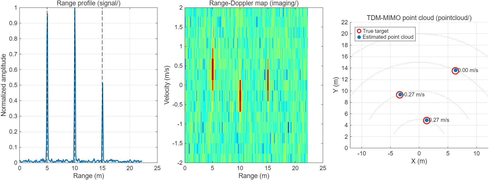
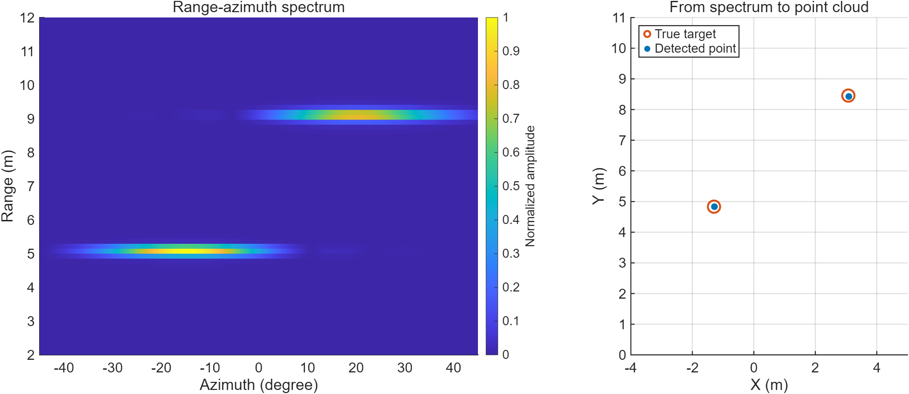
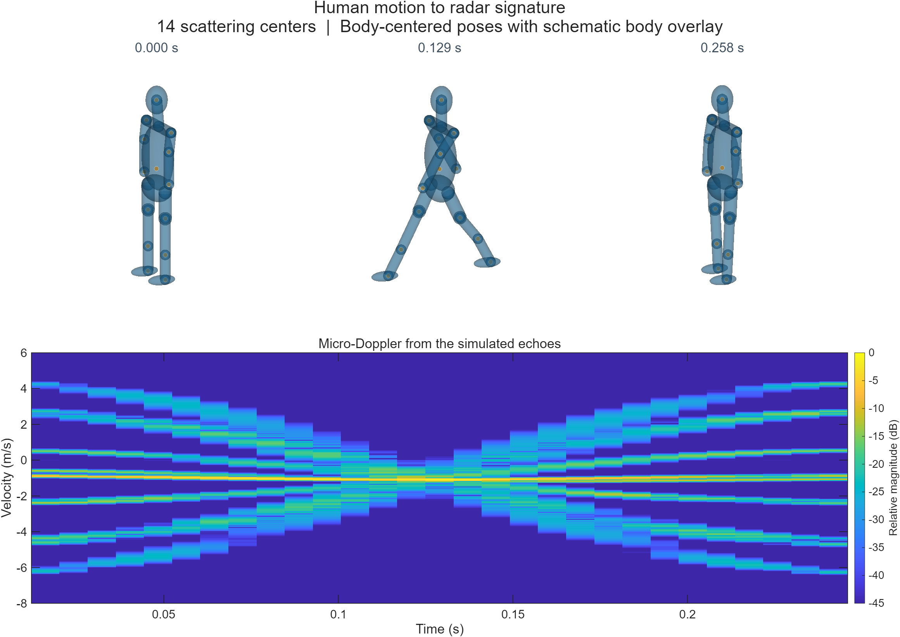
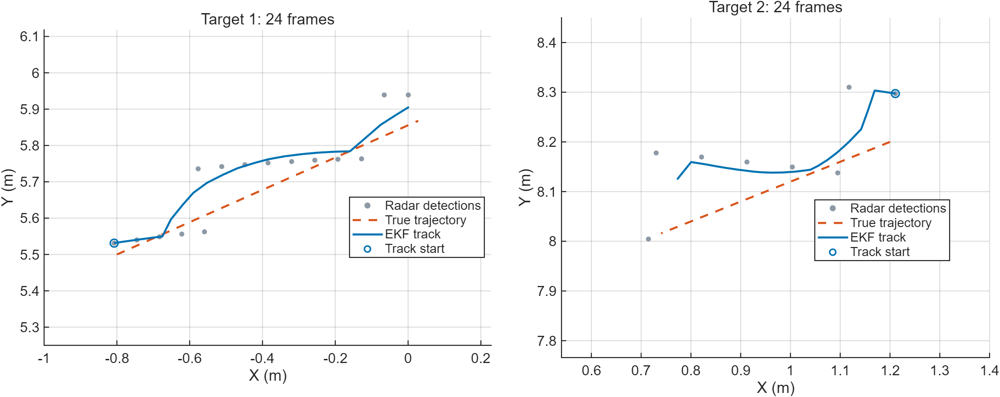
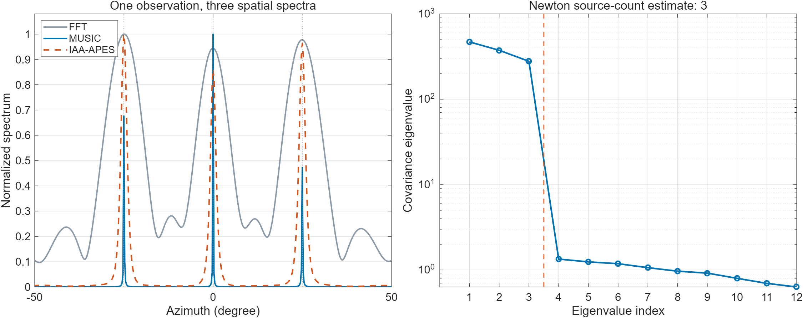
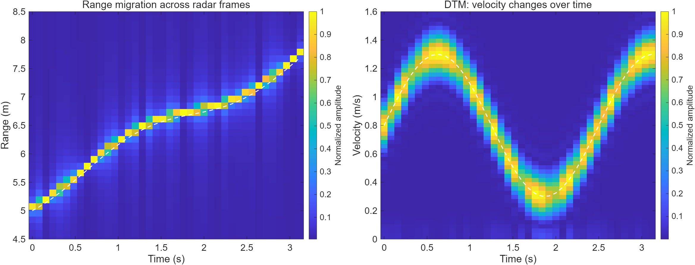
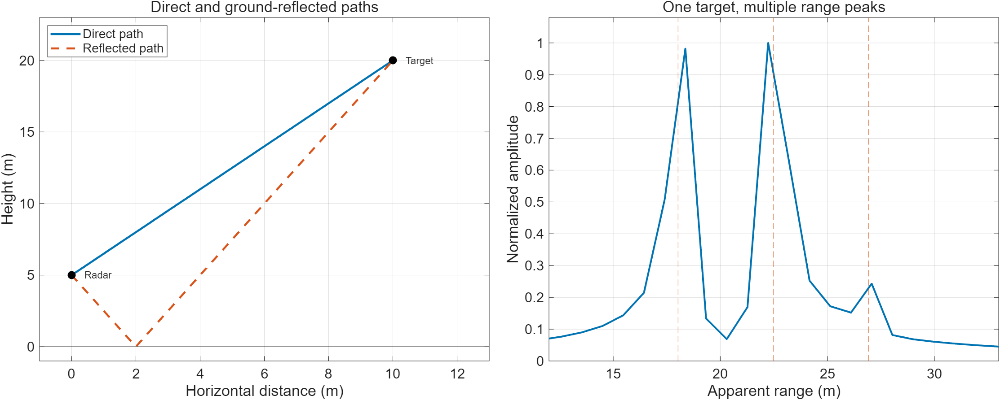
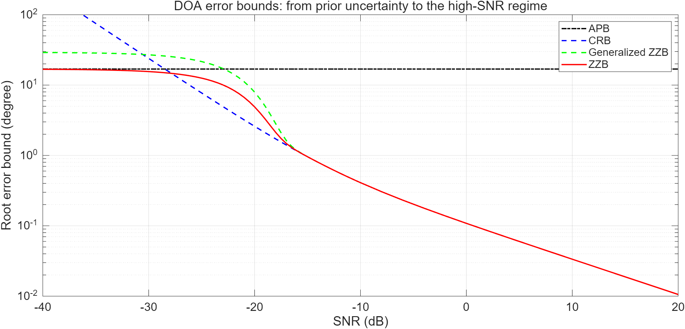

<h1 align="center">FMCW Signal Processing Toolbox</h1>

<p align="center"><strong>English</strong> · <a href="README_zh.md">简体中文</a></p>

<p align="center">
  <strong>One MATLAB toolbox for the whole FMCW mmWave radar chain: echo simulation, raw data, spectra, point clouds, angle estimation, tracking, SAR imaging and performance bounds.</strong>
</p>

<p align="center">
  <strong>Full chain, simulation to tracks</strong> ·
  <strong>One parameter model across the pipeline</strong> ·
  <strong>Visible equations and intermediate results</strong>
</p>

<p align="center">
  <a href="https://github.com/Zhenyu98/FMCW-Signal-Processing-Toolbox/stargazers"></a>
  <a href="LICENSE"></a>
  <a href="https://www.mathworks.com/products/matlab.html"></a>
  <a href="#validation-and-tests"></a>
</p>

<p align="center">
  <a href="#quick-start">Quick Start</a> ·
  <a href="#example-gallery">Gallery</a> ·
  <a href="#modules">Modules</a> ·
  <a href="#data-formats">Data Formats</a> ·
  <a href="#dependencies">Dependencies</a> ·
  <a href="#roadmap">Roadmap</a> ·
  <a href="#faq">FAQ</a> ·
  <a href="#citation-and-acknowledgements">Acknowledgements</a>
</p>

<p align="center">
  
  <br />
  <sub>Three simulated targets, a TI xWR1843-style 3Tx4Rx array, and 20 dB SNR. All three views are generated with this toolbox.</sub>
</p>

## One toolbox, the whole chain

Most radar repositories cover one stage. This one runs from echo simulation to tracks and images along a single MATLAB path:

| Stage | What is included |
| --- | --- |
| Echo simulation | Point targets, multi-scatterer bodies with chirp-level trajectories, TI virtual arrays, optional MathWorks pedestrian and multipath scenes |
| Raw data | DCA1000 `.bin` reader, mmWave Studio capture scripts |
| Spectra and maps | Range-Doppler, range-angle, range-time, Doppler-time, micro-Doppler |
| Point clouds | 2D CFAR, peak grouping, TDM Doppler compensation, RD and RA pipelines |
| Angle estimation | FFT, MUSIC, ESPRIT, IAA, L1-SVD, ANM, plus source-number estimation |
| Tracking | DBSCAN centroids, GNN gating with Hungarian assignment, spherical EKF, track lifecycle |
| SAR imaging | 2D RMA and back-projection |
| Performance bounds | CRB and Ziv-Zakai bounds for DOA |

Simulation, spectra, point clouds and tracking exchange the same radar cube and the same eight-column point cloud, so simulated and measured data run through identical code.

## Spend more time on the algorithm

A range estimator works in isolation. The next question is whether it still works with a different array, moving targets, or measured data. Answering that often means reconnecting signal generation, detection, angle estimation, and tracking before the real experiment can begin.

Much of that work lives at the interfaces: sample and channel dimensions, parameter units, coordinate conventions, and transmit timing. Individual modules can produce plausible outputs while describing different physical scenes.

**FMCW Signal Processing Toolbox brings those components into an inspectable, reusable MATLAB workflow.** Designed for frequency-modulated continuous-wave radar research, it covers echo simulation, raw data reading, range and velocity spectra, 3D point clouds, angle estimation, target tracking, SAR imaging and performance bounds. Use it for signal processing experiments, perception prototypes, and research teaching.

- **Build a complete experiment sooner.** Describe the radar and targets with `sensorParams` and `targetParams`, then connect echoes, detections, point clouds, and tracks through shared processing interfaces.
- **Find the source of an error.** Inspect array geometry, timing, units, coordinates, equations, and intermediate variables to separate modeling and configuration issues from algorithm behavior.
- **Make comparisons reproducible.** Reuse observations and numerical checks across methods, reducing repeated work on signal sources, data conversion, and validation scripts.

```text
sensorParams / targetParams          DCA1000 adc_data.bin
        |                                     |
        v                                     v
signal/RadarCubeGenerate            utils/readDCA1000Raw
        |                                     |
        +----------------> radar cube <-------+
                              |
        +---------------------+---------------------+
        v                     v                     v
imaging/RDM, RAM, DTM     pointcloud/            imaging/RMA, BP
range-Doppler / angle     GeneratePointCloudFrame   SAR imaging
micro-Doppler                 |
                              v
                     frame_data (8-column cloud)
                              |
                              v
                 tracking/TrackPointCloudSequence
                 DBSCAN -> centroid -> GNN -> EKF -> track management
```

| Common task | Toolbox approach |
| --- | --- |
| Generate signals and add noise for each experiment | Use `RadarParameterGenerate` and `RadarCubeGenerate`; control noise with `sensorParams.SNR_dB` |
| Process simulated and measured point clouds | Feed either input into `GeneratePointCloudFrame` after arranging its dimensions |
| Configure array geometry | Select `sensorParams.ArrayType = 'TI_xWRx843'` or supply a virtual antenna map |
| Check whether a change affects existing behavior | Run unit tests in `tests/` and numerical checks in `validation/` |

## Quick start

Tested with MATLAB R2025b, Signal Processing Toolbox, and Phased Array System Toolbox; see [Dependencies](#dependencies). The basic simulations need no radar hardware or measured data.

```bash
git clone https://github.com/Zhenyu98/FMCW-Signal-Processing-Toolbox.git
cd FMCW-Signal-Processing-Toolbox
```

Set the MATLAB current folder to the repository root, then run:

```matlab
startup                          % Add toolbox modules to the search path
demo_pointcloud_sim              % Simulate three targets and generate a point cloud
```

Expected result: the command window prints `FMCW Signal Processing Toolbox path is ready.`, and two figures show a range-Doppler map and a 3D point cloud. Estimated points appear near the red ground-truth targets, with errors due to the discrete range, angle, and velocity grids.

Check the installation with the unit tests:

```matlab
results = runtests('tests', 'IncludeSubfolders', true);
assertSuccess(results)
```

Expected result: `Totals: 32 Passed, 0 Failed, 0 Incomplete`.

The demos execute `clear` and `close all`. Save your workspace and figures first. For help from a coding agent, see [agent-setup.md](agent-setup.md), currently written in Simplified Chinese.

### Minimal example: parameters to point clouds

The following is the core of `demo_pointcloud_sim.m`:

```matlab
%% define parameters
sensorParams.Start_Freq_GHz = 76.5;
sensorParams.Slope_MHzperus = 46.397;
sensorParams.Sampling_Rate_ksps = 6874;
sensorParams.Samples_per_Chirp = 256;
sensorParams.Frame = 64;                    % TDM cycles in one frame
sensorParams.TxNum = 3;
sensorParams.RxNum = 4;
sensorParams.ArrayType = 'TI_xWRx843';      % xWR1843 / xWR6843 ISK style virtual array
sensorParams.SNR_dB = 20;                   % remove this field for clean data

targetParams.amplitude = [20, 20, 10];
targetParams.range = [5, 10, 15];           % m
targetParams.velocity = [0.4, -0.3, 0.1];   % m/s
targetParams.azimuth = [15, -20, 25];       % deg
targetParams.elevation = [0, 8, -5];        % deg

%% generate radar signal
radarParams = RadarParameterGenerate(sensorParams, targetParams);
[data, noiseInfo] = RadarCubeGenerate(targetParams, radarParams);   % SampleNum x ChirpNum x RxNum x TxNum
adcData = RadarCubeToPointCloudInput(data);                         % SampleNum x ChirpNum x ArrayNum

%% point cloud
cfgOut = ConfigurePointCloudParameter(sensorParams, radarParams);
cfgDOA.FFTNum = 180;
cfgDOA.AziMethod = 'FFT';
cfgDOA.EleMethod = 'FFT';
cfgDOA.thetaGrids = linspace(-90, 90, cfgDOA.FFTNum);
cfgDOA.AzisigNum = 1;
cfgDOA.ElesigNum = 1;
cfgDOA.Pfa = 1e-3;
cfgDOA.TestCells = [8, 8];
cfgDOA.GuardCells = [2, 2];

[frame_data, pointcloudInfo] = GeneratePointCloudFrame(adcData, cfgOut, cfgDOA, 1);
% frame_data: X, Y, Z, Range, Azimuth, Elevation, Doppler, SNR   (N x 8; N depends on detections)

%% imaging on the same cube
[dopplerFFTOut, range_axis, velocity_axis] = RDM(data, sensorParams, true);
```

To track a sequence, store one point cloud per cell, in frame order:

```matlab
frameDataSeq{tIdex} = frame_data;           % one cell per frame
[trackingParams, ekfParams] = ConfigureTrackingParameter(sensorParams, radarParams);
[trackResult, measurementSeq] = TrackPointCloudSequence(frameDataSeq, trackingParams, ekfParams);
```

For measured DCA1000 data, configure the acquisition parameters, frame slice, and point cloud settings before using:

```matlab
[radar_data, adcCube, readerInfo] = readDCA1000Raw('adc_data.bin', numADCSamples, numRX, numTX);
adcData = adcCube(:, chirpStart:chirpEnd, :);
[frame_data, pointcloudInfo] = GeneratePointCloudFrame(adcData, cfgOut, cfgDOA, 1);
```

## Example gallery

Explore the pipeline at several levels: target peaks in a spectrum, motion signatures over time, and continuous tracks. All figures below use simulated data generated by the toolbox examples.

### Turn range-azimuth peaks into target locations

Two targets, a 1Tx8Rx array, and 35 dB SNR. The spectrum retains physical range and angle coordinates; the point cloud view compares detections with ground truth to make detection and coordinate conversion easy to inspect.



Run [`demo_pointcloud_ra_sim`](pointcloud/demo_pointcloud_ra_sim.m).

### See motion details in micro-Doppler

A simplified walking model uses 14 moving scatterers. Body translation and limb motion produce different velocity components. Separate 3D pose views mark the scattering centers inside a translucent schematic body, while the spectrum shows their combined radar return.



Run [`demo_human_motion_radar_echo`](signal/demo_human_motion_radar_echo.m). This example uses a simplified motion model and simulated echoes, with no measured human data.

### Connect frame-by-frame detections into tracks

Two targets over 24 simulated radar frames, processed through point cloud generation, association, and an EKF. Each panel zooms in on one target to compare radar detections, the estimated track, and the true trajectory.



Run [`validate_tracking_pointcloud_integration`](validation/validate_tracking_pointcloud_integration.m).

### Compare spatial spectra on the same observation

A 12-element array, 128 snapshots, and 15 dB SNR. FFT, MUSIC, and IAA share one noisy observation; each spectrum is normalized independently. The covariance eigenvalues and Newton source-count estimate are shown alongside them. MUSIC uses the estimated source count; ground truth is used only to check peak locations.



Tools: [`DOA_FFT`](doa/DOA_FFT.m), [`DOA_MUSIC`](doa/DOA_MUSIC.m), [`DOA_IAA`](doa/DOA_IAA.m), and [`Newton_NOS`](source-number-estimation/Newton_NOS.m). This fixed scenario illustrates interfaces and behavior, not a statistical ranking of the methods.

### Follow range and velocity over time

One target changes speed across 40 radar frames. The range spectra show its changing distance; `DTM` produces the velocity-time map. White dashed lines mark the prescribed motion. Slow-time sampling is retained within each frame, with an 80 ms interval between frames.



Tools: [`RadarCubeGenerate`](signal/RadarCubeGenerate.m) and [`DTM`](imaging/DTM.m). Velocity is approximated as constant within each frame. The left panel is computed with a direct range FFT.

### Understand why one target produces multiple range peaks

Direct and ground-reflected paths combine into different apparent ranges for the same target. The propagation geometry is shown alongside a MathWorks two-ray echo spectrum, with expected peak locations marked for comparison.



Tool: [`RadarCubeGenerateMathWorksTwoRay`](signal/RadarCubeGenerateMathWorksTwoRay.m). Run [`validate_mathworks_two_ray_signal_source`](validation/validate_mathworks_two_ray_signal_source.m). The geometry deliberately makes the paths resolvable; Radar Toolbox is required.

### Put angle-estimation errors in context

At low SNR, the prior angular range strongly influences the error bounds. As SNR increases, the bounds converge. The a priori bound (APB), Cramer-Rao bound (CRB), and Ziv-Zakai bound (ZZB) provide a reference for the expected scale of estimation errors.



Tool: [`ZZB_DOAs`](performance/ZZB_DOAs.m). The figure uses the original [`Main_ZZB_Demo`](performance/Main_ZZB_Demo.m) settings: 20 sensors, five incoherent sources, 40 snapshots, and 1,000 random angle draws. These are theoretical error bounds, not measured estimator RMSE. See the original paper in the acknowledgements.

To reproduce the first three gallery sections, run `run('docs/generate_readme_gallery.m')`. For the spatial spectra, Doppler-time map, two-ray model, and bounds, run `run('docs/generate_algorithm_gallery.m')`. Images are exported to `docs/assets/`. Save your workspace and figures first. The second script requires Radar Toolbox for two-ray propagation, and Statistics and Machine Learning Toolbox plus Communications Toolbox for the bounds.

## Modules

| Module | Purpose | Main entry points | Demos |
| --- | --- | --- | --- |
| [signal](signal/README.md) | FMCW echoes, point targets, Cartesian scatterers, chirp-level trajectories, TI virtual arrays, and optional MathWorks sources | `RadarParameterGenerate`, `RadarCubeGenerate`, `AddNoiseBySNR`, `RadarCubeGenerateMathWorks*` | `demo_generate_radar_cube`, `demo_human_motion_radar_echo`, `demo_mathworks_signal_source_switch` |
| [pointcloud](pointcloud/README.md) | Range/Doppler FFT, noncoherent accumulation, CFAR, peak grouping, Doppler compensation, and azimuth/elevation DOA | `GeneratePointCloudFrame`, `GeneratePointCloudFrameRA`, `ConfigurePointCloudParameter`, `CFAR_2D` | `demo_pointcloud_sim`, `demo_pointcloud_ra_sim`, `demo_pointcloud_bin` |
| [tracking](tracking/README.md) | DBSCAN, SNR-weighted centroids, GNN gating, Hungarian assignment, spherical EKF, and track lifecycle | `ConfigureTrackingParameter`, `TrackPointCloudSequence` | `validation/validate_tracking_pointcloud_integration` |
| [imaging](imaging/README.md) | Range-Doppler, range-angle, range-time, Doppler-time, micro-Doppler, RMA, and BP | `RDM`, `RAM`, `RTM`, `DTM`, `MDS`, `SarRMAimaging_2D`, `RAM_BPimaging`, `BPimaging` | `demo_range_doppler_map`, `demo_range_angle_map`, `demo_rma_imaging_2d`, `demo_bp_imaging_2d` |
| `doa/` | Reusable direction-of-arrival estimators | `DOA_FFT`, `DOA_MUSIC`, `DOA_IAA`, `DOA_L1SVD`, `DOA_ANM`, `MUSIC_alg`, `ESPRIT_alg` | Called by point cloud DOA wrappers |
| `source-number-estimation/` | Source count and model order estimation using eigenspace projection and Newton interpolation | `ES_NOS`, `Newton_NOS` | `DNI_compare_with_others` and related scripts |
| `performance/` | Multi-source DOA Ziv-Zakai, Cramer-Rao, and a priori bounds | `ZZB_DOAs` | `Main_ZZB_Demo` |
| [utils](utils/README.md) | DCA1000 raw file reading; mmWave Studio / DCA1000 acquisition helpers (MATLAB + Lua) | `readDCA1000Raw`, `DCA_Connet/` | — |
| [validation](validation/README.md) | Numerical and reference-code equivalence checks | `validate_*.m` | — |
| `tests/` | Unit tests for CFAR, peak grouping, multi-peak DOA, and angle axes | MATLAB `runtests` | — |

Module READMEs provide additional parameter details; most are currently in Simplified Chinese.

## Data formats

**Radar cube:** output of `signal/` and input to compatible imaging functions.

```matlab
% data: SampleNum x ChirpNum x RxNum x TxNum
data(tIdex, pIdex, rxIdex, txIdex)
```

**Point cloud input:** produced by `RadarCubeToPointCloudInput` or `readDCA1000Raw`.

```matlab
% adcData: SampleNum x ChirpNum x ArrayNum    (ArrayNum = RxNum * TxNum)
```

**Point cloud output:** eight columns, consumed by `tracking/`.

```matlab
% frame_data: X, Y, Z, Range, Azimuth, Elevation, Doppler, SNR
frame_data = [XData, YData, ZData, range, azimuth, elevation, doppler, snr];
```

Coordinates: `x` is horizontal, `y` points forward along the radar boresight, and `z` is vertical. Angles in `frame_data` are in degrees.

**Radar parameters:** `sensorParams` uses acquisition units such as GHz, MHz/us, and ksps. `RadarParameterGenerate` derives the physical quantities in SI units. Its fields include:

```matlab
radarParams.f_0, K, Fs, Ts, Ta, Tc, TF, B, fc, lambda
radarParams.range_res, doppler_res, angle_res
radarParams.range_axis, doppler_axis
radarParams.VirtualArrayMap, VirtualPos_m
```

Select a TI virtual array preset or provide your own channel index map:

```matlab
sensorParams.ArrayType = 'TI_xWRx843';       % xWR1843 / xWR6843 ISK
sensorParams.ArrayType = 'TI_xWRx843_ODS';   % xWR6843 ODS / AOP
sensorParams.ArrayType = 'TI_xWRx642';       % xWR1642

sensorParams.VirtualArrayMap = [             % or draw the virtual channel index map by hand
    NaN NaN 8   9   10  11 NaN NaN
    0   1   2   3   4   5   6   7
];
```

## From echoes to tracks

### Signal simulation

- Targets can use `range / velocity / azimuth / elevation`, or Cartesian scatterers in `position_m` with shape `ScatterNum × 3` or `ScatterNum × 3 × PulseNum`. The latter supports dynamic skeletons, gestures, and other multi-scatterer inputs; see `demo_human_motion_radar_echo`.
- The model includes TDM transmit timing. A moving target occupies different ranges at successive Tx times, producing motion phase that is compensated during point cloud processing.
- Optional MathWorks waveform sources use `radarTransceiver`, `backscatterPedestrian`, and `widebandTwoRayChannel`. They produce compatible cubes. TI board-level behavior and real hardware calibration remain outside the current validation scope.
- `sensorParams.SNR_dB` controls complex Gaussian noise; `noiseInfo` records its power. Reuse the same noisy observation across methods within each Monte Carlo trial.

### TDM-MIMO point clouds

- Default RD pipeline: `rdFFT -> incoherent_accumulation -> CFAR_2D -> peakFocus -> compensate_doppler -> azimuthDOA / elevationDOA`.
- Set `cfgDOA.PointCloudPipeline = 'RA'` to detect in a range-azimuth map.
- `CFAR_2D` supports `phased_soca` (default, using `phased.CFARDetector2D`) and `separable_ca`. The latter replaces the detector, while the full pipeline still calls `physconst`.
- OpenRadar-style grouping and multi-peak DOA options are opt-in: `PeakFocusMode = 'py_doppler'` and `DOAPeakSearch = 'py_full_variance'`.

### Point cloud tracking

- Tracking consumes eight-column `frame_data`; ADC, CFAR, and DOA processing are handled upstream.
- EKF state: `[X; Y; Z; Vx; Vy; Vz]`. Measurement: `[range; azimuth; elevation; doppler]`.
- Measurement covariance `R` supports `fixed`, `clusterVar`, and `custom` modes. Supply a custom model through `ekfParams.RBuilder`.
- GNN association uses a bundled Hungarian solver. Track states `tentative -> confirmed -> deleted` follow the TI GTRACK-style `DETECTION -> ACTIVE -> FREE` lifecycle.

### Imaging and time-frequency analysis

- `RDM` and `RAM` accept radar cubes and `sensorParams`, returning physical axes in meters, meters/second, and degrees.
- `DTM` produces per-frame Doppler snapshots; `MDS` computes a slow-time STFT for continuous recordings.
- `SarRMAimaging_2D`, `RAM_BPimaging`, and `BPimaging` support SAR experiments. Their demos prompt for raw echo files and require suitable acquisition geometry.

### Raw data and acquisition

- `readDCA1000Raw(fileName, numADCSamples, numRX, numTX)` returns a cube of shape `numADCSamples × loopChirpNum × (numRX*numTX)`.
- `utils/DCA_Connet/` contains MATLAB/Lua helpers that connect to mmWave Studio through the RSTD interface and trigger DCA1000 capture. They build on TI's Lua examples and use the TI default installation path `C:\ti\mmwave_studio_02_01_01_00`; update it for your machine before use.

## Dependencies

| Dependency | Used by | Scope |
| --- | --- | --- |
| MATLAB R2025b | Tested runtime; demos use `subtitle` | Compatibility with other MATLAB versions requires verification |
| Signal Processing Toolbox | `findpeaks`, `hanning`, and related point cloud/imaging operations | Required for these paths |
| Phased Array System Toolbox | `physconst` and default `phased.CFARDetector2D` | Switching CFAR does not remove the full pipeline's `physconst` dependency |
| Radar Toolbox | Optional `RadarCubeGenerateMathWorks*` sources | Local `RadarCubeGenerate` does not require it |
| [CVX](http://cvxr.com/cvx/) | `DOA_L1SVD`, `DOA_ANM` | Other DOA methods do not require it |
| Communications Toolbox | `qfunc` in `performance/ZZB_DOAs.m` | Required for the bound example |
| Statistics and Machine Learning Toolbox | `unifrnd` in `performance/ZZB_DOAs.m` | Required for that research example |
| TI mmWave Studio and DCA1000 | `utils/DCA_Connet/` acquisition helpers; recording `adc_data.bin` for `readDCA1000Raw` | Not needed for simulation |

The bundled DBSCAN, Hungarian assignment, and EKF implementations do not require Statistics and Machine Learning Toolbox or Sensor Fusion and Tracking Toolbox.

## Validation and tests

**32 unit tests cover CFAR detection, peak selection, angle axes, and multi-peak angle estimation.** Point cloud and tracking checks also test target locations, global assignment, and track continuity, helping catch behavior changes after tuning or replacing a module. See the [validation record](docs/verification.md) for scenarios and numerical results; it is currently in Simplified Chinese.

Run the unit tests from the repository root after `startup`:

```matlab
results = runtests('tests', 'IncludeSubfolders', true);
assertSuccess(results)      % 32 tests
```

The `validation/` folder includes numerical checks and comparisons with reference implementations. Metrics include raw and complex-gain-aligned NMSE, peak locations, point cloud columns, and physical axes. Example commands:

```matlab
run('validation/validate_tracking_core.m')
run('validation/validate_tracking_pointcloud_integration.m')
validate_ra_pointcloud_pipeline;
run('validation/validate_mathworks_ideal_point_target_source.m')
results = validate_pointcloud_equivalence(3);      % needs the original reference project locally
```

Checks that require local reference projects or raw data need their inputs configured first. Missing inputs may cause a skip or an error; a skipped check is not a pass.

RMA/BP, source-number estimation, and performance-bound scripts are research examples; consult their documentation for validation scope. Measured-data imaging and reference comparisons require suitable inputs, acquisition geometry, and dependencies. Numerical results apply to the documented scenarios and should be rechecked when adapting the toolbox to a new system.

## Repository layout

```text
FMCW-Signal-Processing-Toolbox/
├── README.md                   English overview
├── README_zh.md                Simplified Chinese overview
├── startup.m                   Add modules to the MATLAB path
├── signal/                     FMCW echo and radar cube simulation
├── pointcloud/                 TDM-MIMO point cloud processing
├── tracking/                   Clustering, association, EKF, and track management
├── imaging/                    RDM, RAM, RTM, DTM, MDS, RMA, and BP
├── doa/                        Direction-of-arrival estimation
├── source-number-estimation/   Source count estimation
├── performance/                Ziv-Zakai bounds
├── utils/                      DCA1000 raw reader and mmWave Studio acquisition helpers
├── validation/                 Numerical and equivalence checks
├── tests/                      MATLAB unit tests
└── docs/                       Validation record and README assets
```

## Roadmap

Today the toolbox simulates ideal point scatterers and can switch to MathWorks waveform-level scene models. The next steps bring it closer to real radars and real scenes:

- **A more credible physical twin.** Range-dependent attenuation, RCS and richer scenes (moving cyclists, surface clutter, interference), then calibration against measured DCA1000 recordings on the way to a board-level digital twin.
- **More radar models.** Array presets beyond the xWR1843 / xWR6843 / xWR1642 family, starting with TI cascade (AWR2243, 12Tx16Rx) and the coherent use of its redundant virtual channels, plus raw readers for other LVDS layouts.
- **Multi-target tracking.** JPDA and other association methods next to GNN, adaptive measurement noise through the `RBuilder` hook, and validation on measured multi-frame sequences.
- **Smarter point clouds.** Source-number estimation that sets the DOA peak count automatically, and sparse DOA methods without a CVX dependency.
- **Easier to pick up.** A small sample recording for the real-data demo, MATLAB toolbox packaging, and English module documentation.

Suggestions and use cases are welcome in the issues.

## FAQ

**Can I run the point cloud pipeline without Phased Array System Toolbox?**

The full pipeline still calls `physconst`. Setting `separable_ca` only replaces the CFAR detector. Use the dependencies listed above for the validated setup.

**Why do I get no detections, or too many detections?**

A clean simulation lacks a noise floor, so CFAR can select sidelobes. Start with `sensorParams.SNR_dB` set to a value such as 20, then adjust `cfgDOA.Pfa`, `TestCells`, and `GuardCells`. For clean inputs, `cfgDOA.MinPeakSNR_dB` and `MaxDetections` provide post-filtering options.

**What if my recording uses a different chirp count or Tx order?**

Check the recording layout first. Select the appropriate frame slice with `adcCube(:, chirpStart:chirpEnd, :)`, and configure the channel map in `sensorParams.VirtualArrayMap`. Adapt `demo_pointcloud_bin.m` to your acquisition settings.

**Why does TDM Doppler compensation differ by one bin from some reference code?**

The toolbox uses `dopplerBin = dopplerIdx - ChirpNum/2 - 1` to align the velocity axis and compensation phase. The reference comparison notes describe matching range/Doppler front-end results and expected differences in angle/XYZ outputs; see `validation/README.md`.

**How can I reproduce the older one-dimensional ULA model?**

Leave `ArrayType` and `VirtualArrayMap` unset, and set `sensorParams.Center_Freq_Hz = 79e9` and `sensorParams.Antenna_Spacing_m = 1e-3`. The historical pointwise equivalence results are recorded in `signal/README.md`.

**Why use scripts and explicit matrices?**

The toolbox is designed for research: users should be able to read an experiment from top to bottom, set breakpoints, and compare the implementation with a paper's equations. Helpers are extracted where repetition would otherwise obscure the main workflow.

## Citation and acknowledgements

If the toolbox helps your research, you can cite it as:

```bibtex
@software{wu2026fmcwtoolbox,
  author  = {Zhenyu Wu},
  title   = {FMCW Signal Processing Toolbox},
  year    = {2026},
  url     = {https://github.com/Zhenyu98/FMCW-Signal-Processing-Toolbox}
}
```

The project records the following references and contributions. Existing author notices are retained in the corresponding files:

- [TDMA-MIMO](https://github.com/DingdongD/TDMA-MIMO), by Xuliang Yu and collaborators: reference implementations for range/Doppler FFT, CFAR, peak grouping, Doppler compensation, and point cloud DOA wrappers. For these components, also cite X. Yu, Z. Cao, Z. Wu, C. Song, J. Zhu and Z. Xu, "A Novel Potential Drowning Detection System Based on Millimeter-Wave Radar," *ICARCV 2022*, doi: 10.1109/ICARCV57592.2022.10004245.
- [OpenRadar](https://github.com/PreSenseRadar/OpenRadar): reference behavior for `separable_ca` CFAR, `py_doppler` peak grouping, and `py_full_variance` DOA peak search.
- [TI mmWave GTRACK](https://www.ti.com/tool/MMWAVE-SDK): track lifecycle design.
- Z. Zhang, Z. Shi, and Y. Gu, "Ziv-Zakai bound for DOAs estimation," *IEEE Trans. Signal Process.*, vol. 71, pp. 136–149, 2023: the ZZB reference implementation in `performance/`, authored by Zongyu Zhang.
- Jerry Yang: Newton-interpolation source-number estimation scripts in `source-number-estimation/`.
- TI mmWave Studio Lua examples and Xuliang's MATLAB wrappers: the mmWave Studio / DCA1000 acquisition helpers in `utils/DCA_Connet/`.
- MathWorks Radar Toolbox: optional scene sources using `radarTransceiver`, `backscatterPedestrian`, and `widebandTwoRayChannel`.

## Contributing

Issues and pull requests are welcome. Include a minimal reproduction and the relevant `sensorParams` or `cfgDOA` settings. For measured-data issues, describe the acquisition configuration without uploading raw recordings.

## License

See [MIT License](LICENSE) for the project license and [THIRD_PARTY_NOTICES.md](THIRD_PARTY_NOTICES.md) for third-party attribution and applicable terms. Retain the original author notices and citations when using the corresponding implementations. The third-party notes are currently in Simplified Chinese.

## Star History

<a href="https://star-history.com/#Zhenyu98/FMCW-Signal-Processing-Toolbox&Date">
  <picture>
    <source media="(prefers-color-scheme: dark)" srcset="https://api.star-history.com/svg?repos=Zhenyu98/FMCW-Signal-Processing-Toolbox&amp;type=Date&amp;theme=dark&amp;legend=top-left&amp;v=1" />
    <source media="(prefers-color-scheme: light)" srcset="https://api.star-history.com/svg?repos=Zhenyu98/FMCW-Signal-Processing-Toolbox&amp;type=Date&amp;legend=top-left&amp;v=1" />
    
  </picture>
</a>
